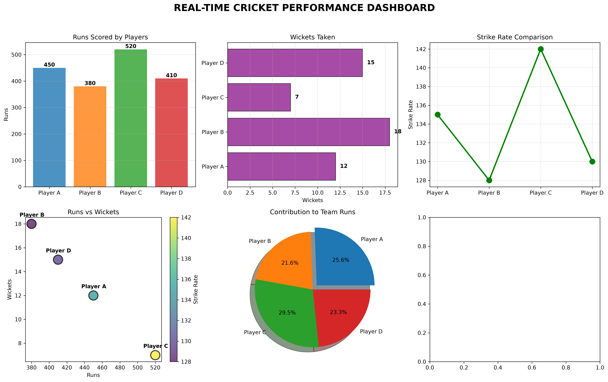
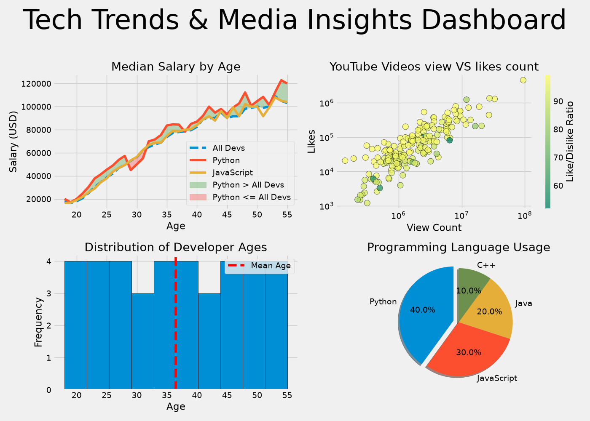

# 📊 Matplotlib Dashboard Lab

### 🏏 Cricket Analytics × 💻 Tech Trends × 📈 Data Visualization

<p align="center">


</p>

<p align="center">
  <b>Turning raw numbers into visual stories.</b>
</p>

---

## 🎯 What Is This Project?

**Matplotlib Dashboard Lab** is a collection of Python-based data visualization projects designed to explore how raw datasets can be transformed into meaningful, interactive and presentation-ready dashboards.

Instead of looking at thousands of numbers in a table, this project turns them into:

🏏 Cricket performance insights
💻 Developer technology trends
📺 YouTube analytics
📈 Statistical comparisons
🎨 Interactive visualizations
⚡ Animated real-time simulations

> **“Data isn’t just numbers — it’s the pulse of performance.”**

---

# 🗺️ Project Overview

This repository currently contains **two major dashboard projects**:

| Project                  | Focus                               | Main Technologies                      |
| ------------------------ | ----------------------------------- | -------------------------------------- |
| 🏏 Cricket Dashboard     | Cricket analytics & live simulation | Python, Matplotlib                     |
| 💻 Tech Trends Dashboard | Developer & YouTube analytics       | Python, Pandas, Matplotlib, mplcursors |

---

# 🏏 01 — Real-Time Cricket Dashboard

📄 **Main File:** `cricket_dashboard.py`

The Cricket Dashboard simulates a live cricket match and converts player and team statistics into multiple visualizations.

The dashboard is designed to feel like a **mini sports analytics system**, where every chart answers a different question.

### 🏏 What Can We Analyze?

* Who scored the most runs?
* Which bowler took the most wickets?
* Which batsman has the highest strike rate?
* How are runs related to wickets?
* How much did each player contribute to the team?
* How does the team's score change ball-by-ball?

---

## 📊 Cricket Visualizations

### 1️⃣ Runs Comparison

A bar chart compares the runs scored by individual players.

**Purpose:**

Identify high-performing batsmen and compare their contributions.

```text
Player Performance
│
│       █
│       █
│   █   █
│   █   █       █
│   █   █   █   █
└──────────────────
   P1  P2  P3  P4
```

---

### 2️⃣ Wickets Comparison

A horizontal bar chart visualizes wickets taken by bowlers.

**Purpose:**

Quickly identify bowling impact.

---

### 3️⃣ Strike Rate Analysis

A line plot compares player strike rates.

**Purpose:**

Understand batting efficiency rather than only looking at total runs.

> A player scoring 40 runs from 20 balls and another scoring 40 from 50 balls have the same runs but very different strike rates.

---

### 4️⃣ Runs vs Wickets

A scatter plot explores the relationship between batting performance and bowling performance.

The visualization also uses **strike rate-based color information** to provide another dimension of analysis.

---

### 5️⃣ Team Contribution

A pie chart represents each player's percentage contribution to the team's total score.

**Question answered:**

> “Who contributed how much to the final team score?”

---

### 6️⃣ 🟢 Live Match Score

The dashboard uses:

```python
matplotlib.animation.FuncAnimation
```

to simulate ball-by-ball score progression.

Instead of displaying a static chart, the score develops dynamically over time.

```text
Score
100 |                         ●
 80 |                    ●
 60 |              ●
 40 |         ●
 20 |    ●
  0 |____________________________
       Ball → → → → → → → → →
```

---

# 📁 Cricket Dashboard Outputs

Generated visualizations are stored inside:

```text
outputs/
```

| File                   | Visualization      |
| ---------------------- | ------------------ |
| `1_basic_line.png`     | Basic Line Plot    |
| `2_bar_chart.png`      | Runs Comparison    |
| `3_horizontal_bar.png` | Wickets Comparison |
| `4_scatter_plot.png`   | Runs vs Wickets    |
| `5_pie_chart.png`      | Team Contribution  |
| `final_dashboard.png`  | Combined Dashboard |

---

# 💻 02 — Tech Trends & Media Insights Dashboard

📂 **Folder:** `data_visualization_dashboard/`

📄 **Main File:** `dashboard.py`

This dashboard moves beyond sports analytics and explores real-world technology and media datasets.

It combines:

👨‍💻 Developer salary data
📺 YouTube analytics
🎂 Age distribution
💻 Programming language usage

into a single visual analytics experience.

---

# 📈 Dashboard Components

## 💰 1. Developer Salary by Age

A line plot compares median salary trends between:

* Python developers
* All developers

### Question:

> Does developer age have a relationship with median salary?

The visualization makes it easier to identify overall trends without manually analyzing every row.

---

## 📺 2. YouTube Views vs Likes

A scatter plot compares:

```text
Views  ↔  Likes
```

Additional color information represents the like/view relationship.

### Questions:

* Do videos with more views generally receive more likes?
* Which videos behave differently from the overall pattern?
* Are highly viewed videos necessarily highly engaged?

---

## 🎂 3. Age Distribution

A histogram displays the distribution of developer ages.

A mean indicator is included to provide a reference point.

```text
Frequency
│
│       ███
│    ███████
│  ██████████
│ ███████████
└──────────────────
    Age →
```

This provides a quick understanding of the dataset's age structure.

---

## 💻 4. Programming Language Usage

A pie chart visualizes programming language usage.

This makes it possible to quickly compare the relative share of languages represented in the dataset.

---

## 🖱️ 5. Interactive Hover Insights

The dashboard uses:

```python
mplcursors
```

to provide interactive information when hovering over plotted data.

Instead of only looking at visual positions, users can inspect individual data points.

---

# 🧠 Technologies Used

| Technology     | Purpose                       |
| -------------- | ----------------------------- |
| 🐍 Python      | Core programming language     |
| 📊 Matplotlib  | Data visualization            |
| 🐼 Pandas      | Data processing               |
| 🖱️ mplcursors | Interactive hover information |
| 📄 CSV         | Dataset storage               |

---

# 🗂️ Repository Structure

```text
matplotlib-dashboard-project/
│
├── 📂 data_visualization_dashboard/
│   ├── dashboard.py
│   ├── data.csv
│   └── ytdata.csv
│
├── 📂 outputs/
│   ├── 1_basic_line.png
│   ├── 2_bar_chart.png
│   ├── 3_horizontal_bar.png
│   ├── 4_scatter_plot.png
│   ├── 5_pie_chart.png
│   ├── dashboard.png
│   └── final_dashboard.png
│
├── 🏏 cricket_dashboard.py
├── 📜 LICENSE
└── 📖 README.md
```

---

# ⚙️ Installation

## 1. Clone the Repository

```bash
git clone https://github.com/savansojitra99988/matplotlib-dashboard-project.git
```

## 2. Enter the Project

```bash
cd matplotlib-dashboard-project
```

## 3. Install Dependencies

```bash
pip install pandas matplotlib mplcursors
```

---

# ▶️ Running the Dashboards

## 🏏 Run Cricket Dashboard

```bash
python cricket_dashboard.py
```

## 💻 Run Tech Trends Dashboard

```bash
python data_visualization_dashboard/dashboard.py
```

---

# 🔄 How the Project Works

The overall workflow can be represented as:

```text
              ┌───────────────┐
              │   Raw Data    │
              └───────┬───────┘
                      ↓
              ┌───────────────┐
              │    Pandas     │
              │ Data Handling │
              └───────┬───────┘
                      ↓
              ┌───────────────┐
              │ Data Analysis │
              └───────┬───────┘
                      ↓
          ┌───────────┴───────────┐
          ↓                       ↓
   ┌──────────────┐        ┌──────────────┐
   │ Matplotlib   │        │ mplcursors   │
   │ Visualization│        │ Interaction  │
   └───────┬──────┘        └───────┬──────┘
           │                       │
           └───────────┬───────────┘
                       ↓
              ┌────────────────┐
              │    Dashboard   │
              └────────────────┘
```

---

# 🎨 Visualization Techniques Used

This project demonstrates several important visualization techniques:

### 📌 Line Plot

Used for:

* Trends
* Score progression
* Salary analysis

### 📌 Bar Chart

Used for:

* Player comparison
* Category comparison

### 📌 Horizontal Bar Chart

Used for:

* Ranking
* Wicket comparison

### 📌 Scatter Plot

Used for:

* Relationship analysis
* Correlation exploration

### 📌 Pie Chart

Used for:

* Contribution
* Percentage distribution

### 📌 Histogram

Used for:

* Frequency distribution
* Age analysis

### 📌 Animation

Used for:

* Simulated live cricket score progression

---

# 🧪 What I Learned From This Project

This project was built as a practical learning journey through Python data visualization.

### 🐍 Python

* Lists
* Dictionaries
* Functions
* Loops
* Data processing

### 🐼 Pandas

* Reading CSV files
* Filtering data
* Grouping data
* Calculating statistics
* Working with DataFrames

### 📊 Matplotlib

* Figure creation
* Axes
* Line plots
* Bar charts
* Scatter plots
* Pie charts
* Histograms
* Legends
* Labels
* Titles
* Subplots
* Animation

### 🖱️ Interactivity

* Hover-based data inspection
* Dynamic visualization

---

# 🚀 Future Improvements

The project can be expanded into a more complete analytics platform.

### 🏏 Cricket Dashboard

* [ ] Real cricket API integration
* [ ] Live match data
* [ ] Player profiles
* [ ] Team comparison
* [ ] Run-rate graph
* [ ] Required run-rate
* [ ] Partnership analysis
* [ ] Powerplay analysis
* [ ] Player form analysis
* [ ] Match prediction models

### 💻 Tech Dashboard

* [ ] More developer datasets
* [ ] Job-market analysis
* [ ] Technology popularity trends
* [ ] Country-wise developer analysis
* [ ] Experience vs salary analysis
* [ ] Skill-demand analysis
* [ ] More interactive filters

### 🌐 Platform Improvements

* [ ] Streamlit web dashboard
* [ ] Database integration
* [ ] REST API integration
* [ ] Real-time data updates
* [ ] Dark/light dashboard themes
* [ ] Deployment to cloud

---

# 📸 Dashboard Preview

Add your screenshots here:

```markdown



```

You can also create a dedicated gallery:

```text
📸 Dashboard Gallery

🏏 Cricket Analytics
   └── Player Performance
   └── Bowling Analysis
   └── Strike Rate
   └── Team Contribution
   └── Live Score

💻 Tech Analytics
   └── Salary Trends
   └── YouTube Analytics
   └── Age Distribution
   └── Language Usage
```

---

# 📊 Project Highlights

| Feature                     | Included |
| --------------------------- | :------: |
| Python Data Processing      |     ✅    |
| Pandas                      |     ✅    |
| Matplotlib                  |     ✅    |
| Multiple Chart Types        |     ✅    |
| Animated Visualization      |     ✅    |
| Interactive Hover           |     ✅    |
| CSV Data Analysis           |     ✅    |
| Dashboard Design            |     ✅    |
| Cricket Analytics           |     ✅    |
| Tech Analytics              |     ✅    |
| Saved Visualization Outputs |     ✅    |

---

# 💡 Why This Project?

Most datasets start as rows and columns.

The real challenge is turning those rows and columns into something a human can understand.

This project explores that transformation:

```text
        RAW DATA
           ↓
       ANALYSIS
           ↓
      VISUALIZATION
           ↓
        INSIGHT
           ↓
       DECISION
```

The goal is not simply to create graphs.

The goal is to make the **data tell a story**.

---

# 👨‍💻 About the Developer

## Savan Sojitra

**Data Visualization & Dashboard Enthusiast**

📍 Gujarat, India

Interested in:

* 🐍 Python
* 📊 Data Visualization
* 🤖 Artificial Intelligence
* 💻 Software Development
* 🏏 Cricket Analytics
* 🎨 Creative Technology Projects

> **“Visualization is the art of making data speak — this project is my canvas.”**

---

# ⭐ If You Like This Project

If you find this project useful or interesting:

⭐ Star the repository
🍴 Fork the repository
💡 Explore the visualizations
🐛 Report issues
🚀 Build your own dashboard

---

# 📜 License

This project is licensed under the **MIT License**.

You are free to use, modify, and distribute the project according to the license terms.

---

<div align="center">

### 📊 Data → Code → Visualization → Insight

**Built with Python 🐍 + Matplotlib 📈 + Curiosity 🧠**

⭐ **Matplotlib Dashboard Lab** ⭐

</div>
